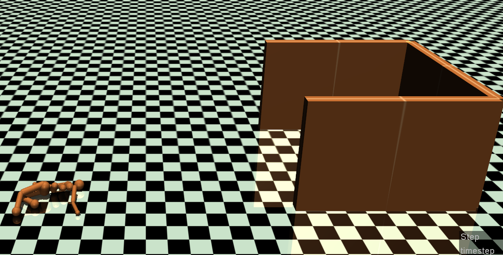

## Humanoid-Maze

This is the mujoco env originally created by Uber-Research. Since they don't seem to explicitly publish this great env, I've decided to do that. So do give them credit!!

## Installation

**Note**: the installation requires you to modify the `site-package` of python so that if you happen to find the better way, do let me know! I don't like this method as well! lol

1. Copy and paste the content of `./humanoid_maze/assets/humanoid_maze.xml` to the file named `/usr/local/lib/python3.6/site-packages/gym/envs/mujoco/assets/humanoid_maze.xml`
2. Pip install this repo as following: `pip install -e .`
3. Try `test/sample.py`

## Reference

- how to create new openai env: https://medium.com/@apoddar573/making-your-own-custom-environment-in-gym-c3b65ff8cdaa
- humanoid_maze: https://github.com/uber-research/deep-neuroevolution